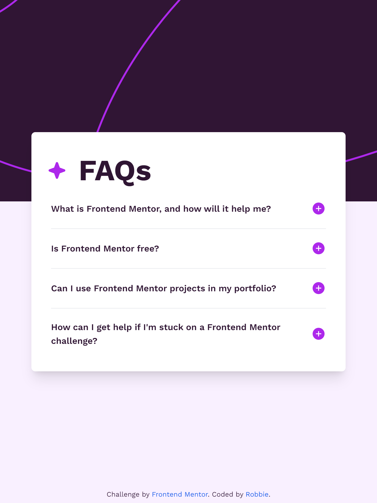

# Frontend Mentor - FAQ accordion solution

This is a solution to the [FAQ accordion challenge on Frontend Mentor](https://www.frontendmentor.io/challenges/faq-accordion-wyfFdeBwBz). Frontend Mentor challenges help you improve your coding skills by building realistic projects. 

## Table of contents

- [Overview](#overview)
  - [The challenge](#the-challenge)
  - [Screenshot](#screenshot)
  - [Links](#links)
- [My process](#my-process)
  - [Built with](#built-with)
  - [What I learned](#what-i-learned)
  - [Continued development](#continued-development)
  - [Useful resources](#useful-resources)
- [Author](#author)
- [Acknowledgments](#acknowledgments)

## Overview

### The challenge

Users should be able to:

- Hide/Show the answer to a question when the question is clicked
- Navigate the questions and hide/show answers using keyboard navigation alone
- View the optimal layout for the interface depending on their device's screen size
- See hover and focus states for all interactive elements on the page

### Screenshot



### Links

- Solution URL: [https://github.com/robbiedob21/faq-accordion-main](https://github.com/robbiedob21/faq-accordion-main)
- Live Site URL: [https://robbiedob21-accordion.netlify.app/](https://robbiedob21-accordion.netlify.app/)

## My process

### Built with

- Semantic HTML5 markup
- Tailwind CSS

### What I learned

I learnt about the details html tag for the first time during this project, as well using the details tag I used the open attribute and summary tag that are part and parcel of using the details tag.

I have not really played with after pseudo code before and this was a good learning experience.

```html
<details class="group">
  <summary
    class="py-2 sm:py-4 sm:text-lg group-hover:text-pink font-semibold list-none active:text-pink flex gap-1 justify-between items-center after:content-plus after:h-8 group-open:after:content-minus"
  >
    What is Frontend Mentor, and how will it help me?
  </summary>
  <p class="text-grayish-purple pb-2 sm:pb-4">
    Frontend Mentor offers realistic coding challenges
    to help developers improve their frontend coding
    skills with projects in HTML, CSS, and JavaScript.
    It's suitable for all levels and ideal for portfolio
    building.
  </p>
</details>
```

### Continued development

I enjoyed playing with the background of this design as but I still feel like I need to get the hang of styling images.

### Useful resources

- [The "open" Modifier in Tailwind CSS](https://www.youtube.com/watch?v=_PSAD4LUx9s) - This very simply and easily explained how to use the open attribute with tailwind CSS.

## Author

- Website - [Robbie](https://www.robbie.kiwi)
- Frontend Mentor - [@robbiedob21](https://www.frontendmentor.io/profile/robbiedob21)

## Acknowledgments

Shout out to [Simon Swiss](https://twitter.com/simonswiss)!

Thanks again to Front End Mentor for the great project.
